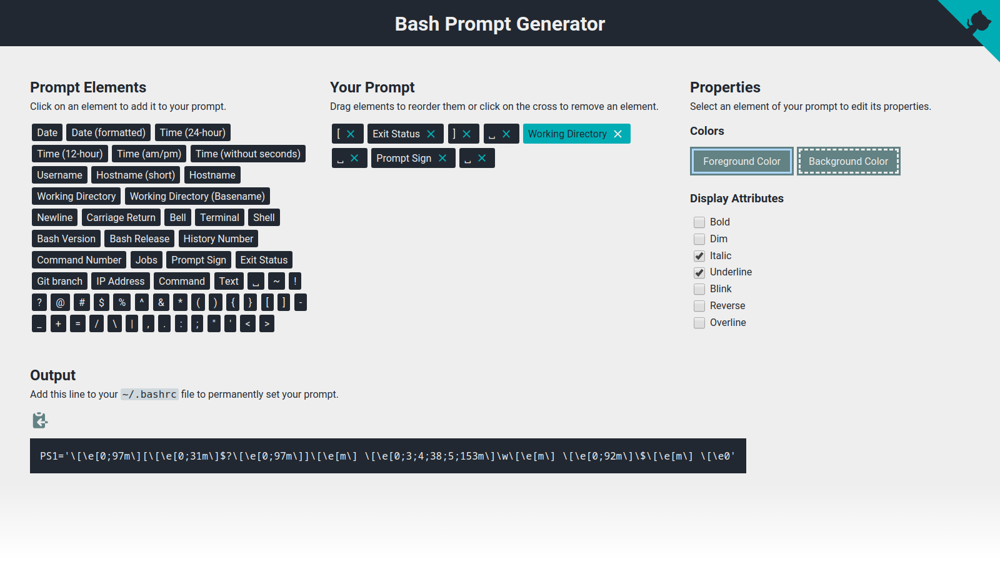

# Bash Prompt Generator

  

  <b>Create a custom PS1 variable for your Bash.</b>
    
  

## Example

### Result

## See also

- [GNU Bash Manual: Controlling the Prompt](https://www.gnu.org/software/bash/manual/html_node/Controlling-the-Prompt.html)
- [ArchWiki: Bash/Prompt customization](https://wiki.archlinux.org/index.php/Bash/Prompt_customization)

## License

Copyright (C) 2020 Scriptim

This program is free software: you can redistribute it and/or modify it under the terms of the GNU General Public License as published by the Free Software Foundation, either version 3 of the License, or (at your option) any later version.

This program is distributed in the hope that it will be useful, but WITHOUT ANY WARRANTY; without even the implied warranty of    MERCHANTABILITY or FITNESS FOR A PARTICULAR PURPOSE.  See the GNU General Public License for more details.

You should have received a [copy of the GNU General Public License](./LICENSE) along with this program.  If not, see <https://www.gnu.org/licenses/>.
