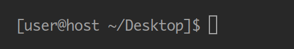
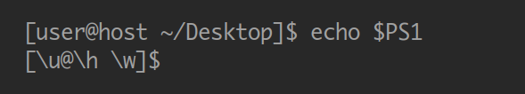
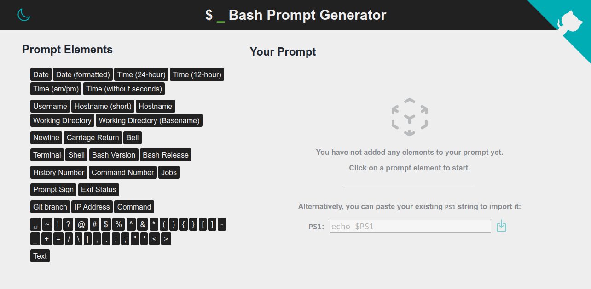
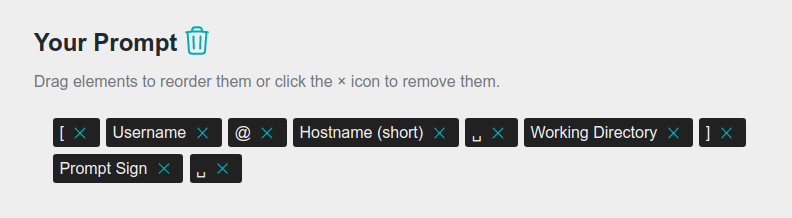
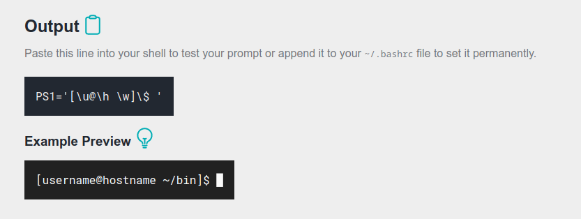
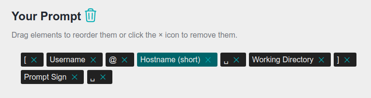
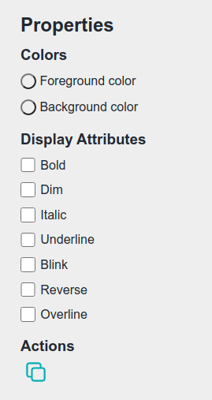
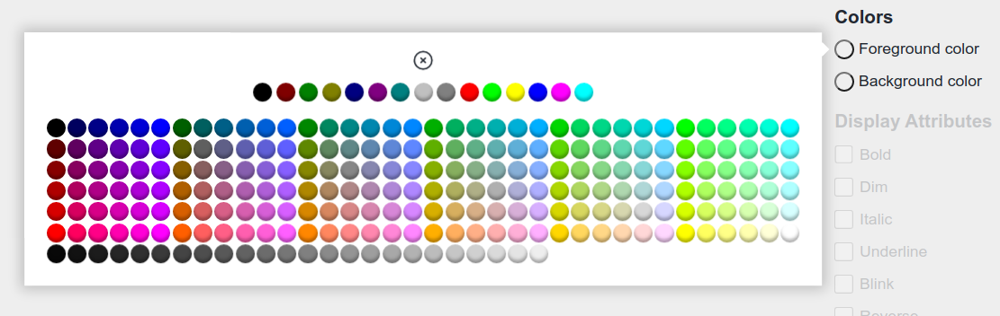

# Bash Prompt Generator

**Create a custom PS1 variable for your Bash.**

&emsp;

<!-- badge generated using https://forthebadge.com/generator/ -->

## What is a Bash  Prompt?

The prompt is a short piece of text that is displayed in the Bash shell prompting you to enter a command.

It usually contains some useful information about the current user, the working directory, etc.

## Where is the Prompt Configured?

The `PS1` environment variable determines what information the prompt contains and how it is displayed.

The default value may vary between different distributions and versions.

Setting the `PS1` variable yourself (e.&nbsp;g. by appending the line `PS1='[\u@\h \w]\$ '` to your `~/.bashrc` file) allows you to customize your prompt.

## How is the Prompt Configured?

The syntax of the `PS1` variable allows versatile customization options.
In addition to the information displayed, colors as well as other display attributes can be adjusted.

However, this syntax is difficult to read by humans and manual customization is therefore extremely tedious.

For this reason, this project provides a way to create a prompt via a GUI without having to modify the PS1 variable itself.

### See also

- [GNU Bash Manual: Controlling the Prompt](https://www.gnu.org/software/bash/manual/html_node/Controlling-the-Prompt.html)
- [ArchWiki: Bash/Prompt customization](https://wiki.archlinux.org/index.php/Bash/Prompt_customization)

## How to Use

### Getting Started

When you visit the [website](https://bash-prompt-generator.org) for the first time, you have the option to either create a new prompt from scratch or import your current prompt for adjustment.

A prompt consists of multiple so-called *elements*.
You can click on one of the elements on the left (*Prompt Elements*) to add it to your prompt.
If you choose to import your existing prompt, paste the output of `echo $PS1` (e.&nbsp;g. `[\u@\h \w]\$ `) into the text field and the according elements will be automatically added to your prompt.

### Your Prompt

The *Your Prompt* section lists all elements that are currently part of your prompt.

You can always add more elements from the *Prompt Elements* section on the left, reorder the elements in your prompt using drag and drop or remove them.

The trash icon will remove all elements from your prompt, letting you start from scratch.

The command for setting the `PS1` variable is displayed in the *Output* section, along with an example preview of how your prompt might look like.

The clipboard icon will copy the full command to your clipboard.

If you run the generated command in your terminal, you will immediately see the changes to your prompt.
These changes will be lost when you close your terminal, however.
In order to make the changes permanent, you have to add the command to your `~/.bashrc` file.

Note that the preview will most likely differ from the actual prompt in your terminal because the environment (such as the current user, hostname, etc.) is different.

You can click on the lightbulb icon to toggle between a dark and a light background for the preview.

### Properties

All elements can be selected by clicking on them.

Depending on the type of the selected element, different properties can be adjusted.

Most elements support colors and various display attributes.

Look at the example preview to see how these properties affect the prompt.

Foreground and background colors can be choosen via a color picker.

The color picker provides a *no color* option for resetting to the default color, 16 4-bit colors (top row) and 256 8-bit colors (bottom rows).

Note that some terminals may not support all colors.
The same applies to display attributes.

Additionally, you can duplicate the selected element with the copy icon under *Actions*.

#### Special Elements

Some element types have special properties:

* *Date (formatted)* requires a string specifying the date format which will be passed to [`strftime(3)`](https://linux.die.net/man/3/strftime "man 3 strftime").
* *Command* requires a string specifying the command to be executed.
The prompt will contain the standard output of the command.
  * The *Git Branch* and *IP Address* elements are functionally equivalent to a *Command* element with the command already filled in.
* *Text* requires an arbitrary string that will be included as is in the prompt.
* *Environment Variable* requires the name of an environment variable and configuring the [parameter expansion](https://www.gnu.org/software/bash/manual/html_node/Shell-Parameter-Expansion.html "GNU Bash Manual: Shell Parameter Expansion").
* *Nerd Font Glyph* requires the class name of a [Nerd Font glyph](https://www.nerdfonts.com/cheat-sheet "Nerd Fonts Cheat Sheet").

## License

Copyright (C) 2017 - 2025 Scriptim

This program is free software: you can redistribute it and/or modify it under the terms of the GNU General Public License as published by the Free Software Foundation, either version 3 of the License, or (at your option) any later version.

This program is distributed in the hope that it will be useful, but WITHOUT ANY WARRANTY; without even the implied warranty of    MERCHANTABILITY or FITNESS FOR A PARTICULAR PURPOSE.  See the GNU General Public License for more details.

You should have received a [copy of the GNU General Public License](./LICENSE) along with this program.  If not, see <https://www.gnu.org/licenses/>.
